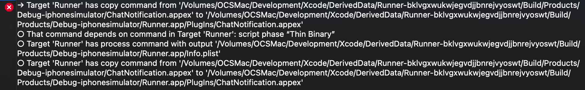
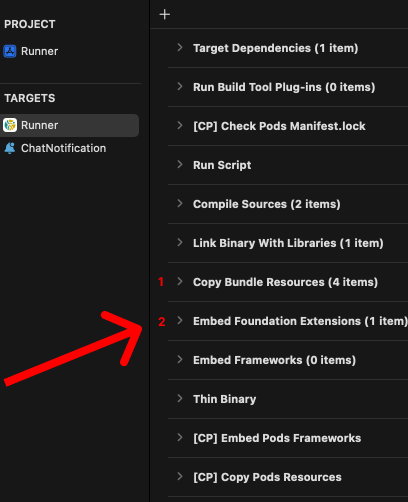

# Firebase Cloud Messaging Implementation Guide

## Overview
This guide covers the implementation of Firebase Cloud Messaging (FCM) for both Android and iOS platforms, including chat notifications and general push notifications.

## Android Implementation

### Prerequisites
1. Firebase project setup
2. Firebase SDK integration
3. Valid FCM server key

### Configuration Steps

#### 1. Notification Icon Setup
- Create and add `notification_icon.png` to the drawable resources directory
- Ensure the icon follows Material Design guidelines for notification icons

#### 2. AndroidManifest.xml Configuration
Add the following metadata within the `<application>` tag:
```xml
<meta-data
    android:name="com.google.firebase.messaging.default_notification_icon"
    android:resource="@drawable/notification_icon"/>
```

### Payload Structures

#### Chat Notification Payload
```json
{
    "message": {
        "token": "<FCM_TOKEN>",
        "data": {
            "type": "chat",
            "group_name": "Room Name",
            "group_id": "group_identifier",
            "sender_id": "sender_identifier",
            "sender_name": "Sender Name",
            "message": "Message content",
            "icon": "notification_icon",
            "avatar": "avatar_url"
        }
    }
}
```

> **Important Note**: For Android chat notifications, remove the `notification` object from the payload to ensure proper handling of custom notifications.

## iOS Implementation

### Prerequisites
- Apple Developer Account
- Valid APNs certificate
- Xcode project with Firebase SDK integrated

### Configuration Steps

#### 1. Enable Required Capabilities
In Xcode, enable the following capabilities:
- Push Notifications
- Communication Notifications
- Background Modes:
  - Background fetch
  - Remote notifications

#### 2. Info.plist Configuration
Add Communication Notifications support:
```xml
<key>NSUserActivityTypes</key>
<array>
    <string>INSendMessageIntent</string>
</array>
```

#### 3. Notification Service Extension
1. Create a new Notification Service Extension:
   - Navigate to File > New > Target
   - Search for "Notification Service Extension"
   - Set name as "ChatNotification"
   - Select Swift as the language
   - Enable "Activate" option
   - Edit swift code: ChatNotification > [NotificationService.swift](ChatNotificationSwift.md)

#### iOS Chat Notification Payload
```json
{
    "message": {
        "token": "<FCM_TOKEN>",
        "apns": {
            "payload": {
                "aps": {
                    "alert": {
                        "title": "Sender Name",
                        "body": "Message Content"
                    },
                    "mutable-content": 1,
                    "content-available": 1,
                    "sound": "default"
                }
            }
        },
        "data": {
            "type": "chat",
            "group_name": "Room Name",
            "group_id": "group_identifier",
            "group_avatar": "group_avatar_url",
            "sender_id": "sender_identifier",
            "sender_name": "Sender Name",
            "message": "Message content",
            "avatar": "sender_avatar_url"
        }
    }
}
```

#### Standard Notification Payload
```json
{
    "message": {
        "token": "<FCM_TOKEN>",
        "notification": {
            "title": "Notification Title",
            "body": "Notification Content"
        }
    }
}
```

## Best Practices
1. Always test notifications in both foreground and background states
2. Handle token refresh and updates appropriately
3. Implement proper error handling for failed notification deliveries
4. Store and manage FCM tokens securely
5. Follow platform-specific design guidelines for notifications

## Troubleshooting
- Verify FCM token validity
- Check payload format matches platform requirements
- Ensure all required capabilities are enabled
- Validate notification icon specifications
- Monitor Firebase Console for delivery statistics


## Fixed bug on IOS


iOS Build Phase Fix
To resolve build issues on iOS, ensure the Runner > Build Phases > Order follows the correct sequence as shown in the documentation images.


